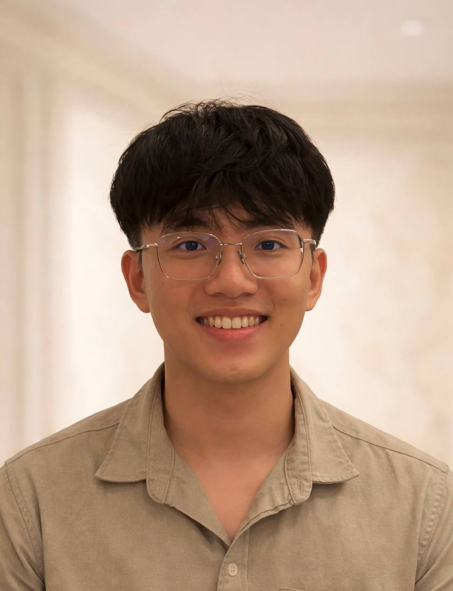
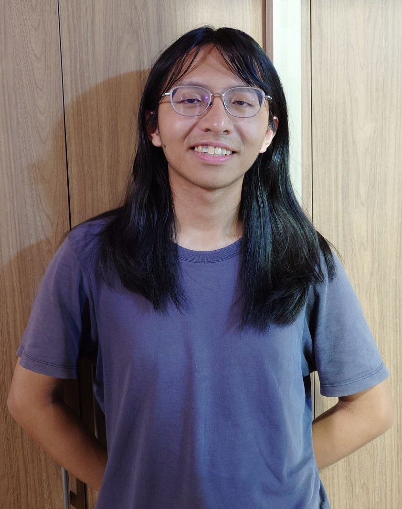

# About Us

We are a team based in the [School of Computing, National University of Singapore](http://www.comp.nus.edu.sg).

You can reach us at the email `seer[at]comp.nus.edu.sg`

## Project team

### Toh Hong Shen

[[github](https://github.com/ths1959)]
[[portfolio](team/ths1959.md)]

* **Role**: Team Lead
* **Responsibilities**: Overall project coordination, In charge of Storage

### Yap Ming Yang

[[github](http://github.com/mingjelly)] [[portfolio](team/mingjelly.md)]

* Role: Developer
* Responsibilities: Data

### Leong Yi Xuan

[[github](http://github.com/lyx-888)]
[[portfolio](team/lyx-888.md)]

* Role: Developer
* Responsibilies: UI

### Ong Jin Hui

[[github](http://github.com/poise3)]
[[portfolio](team/poise3.md)]

* Role: Developer
* Responsibilities: Dev Ops + Threading

### Derrick Low

[[github](http://github.com/derrikzzz)]
[[portfolio](team/derrikzzz.md)]

* Role: Developer
* Responsibilities: Integration

### Zhou Guangyi

[[github](http://github.com/2520th)]
[[portfolio](team/2520th.md)]

* Role: Developer
* Responsibilities: Logic/Command Parsing