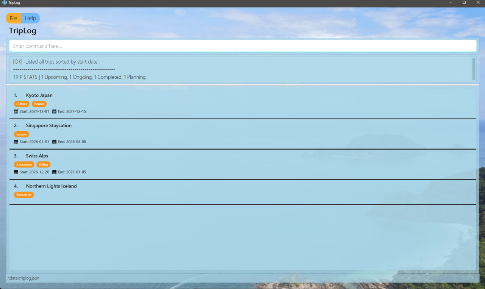
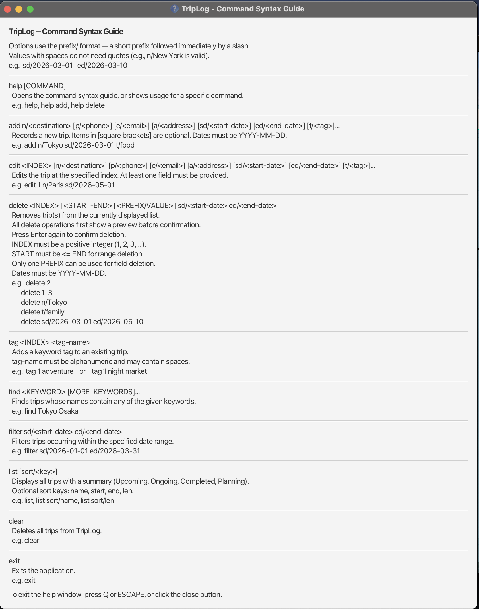
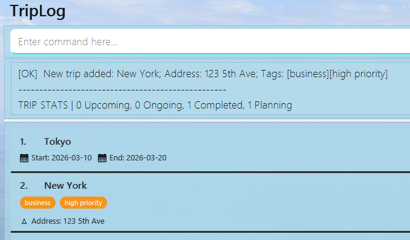
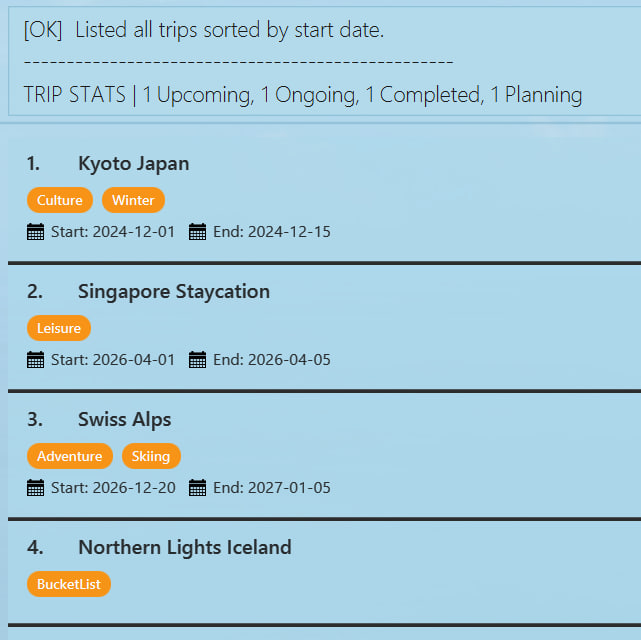

# TripLog User Guide

TripLog is a **desktop app for managing trips, optimized for use via a Command Line Interface** (CLI) while still having the benefits of a Graphical User Interface (GUI). If you can type fast, TripLog can get your travel management tasks done faster than traditional GUI apps.

<page-nav-print />

---

## Quick start

1. Ensure you have Java `17` or above installed in your Computer. 
   **Mac users:** Ensure you have the precise JDK version prescribed [here](https://se-education.org/guides/tutorials/javaInstallationMac.html).

1. Download the latest `.jar` file from [here](https://github.com/AY2526S2-CS2103-F13-2/tp/releases).

1. Copy the file to the folder you want to use as the _home folder_ for your TripLog.

1. Open a command terminal, `cd` into the folder you put the jar file in, and use the `java -jar triplog.jar` command to run the application. 
   A GUI similar to the below should appear in a few seconds. **Upon startup, TripLog automatically displays a summary dashboard and your last used sort order.**

1. Type the command in the command box and press Enter to execute it. e.g. typing **`help`** and pressing Enter will open the help window. 
   Some example commands you can try:
    - `list` : Lists all trips and shows a status summary.
    * `add n/Tokyo Japan sd/2026-03-10 ed/2026-03-20` : Adds a trip to Tokyo.
    * `delete 3` : Deletes the 3rd trip shown in the current list.
    * `clear` : Deletes all entries.
    - `exit` : Exits the app.

1. Refer to the [Features](#features) below for details of each command.

---

## Features

<box type="info" seamless>

**Notes about the command format:** 

- **Command words are case-insensitive.** 
  e.g. `ADD`, `Add`, and `add` are all recognized as the same command.

- Words in `UPPER_CASE` are the parameters to be supplied by the user. 
  e.g. in `add n/NAME`, `NAME` is a parameter which can be used as `add n/National Museum`.

- Values with spaces do not need quotes — the parser reads up to the next prefix. 
  e.g. `n/New York` and `a/123 Main St` are both valid.

- Items in square brackets are optional. 
  e.g `n/NAME [sd/DATE]` can be used as `n/Tokyo sd/2026-01-01` or as `n/Tokyo`.

- Items with `…​` after them can be used multiple times including zero times. 
  e.g. `[t/TAG]…​` can be used as ` ` (i.e. 0 times), `t/nature`, `t/nature t/photo` etc.

- Parameters can be in any order. 
  e.g. if the command specifies `n/NAME p/PHONE`, `p/PHONE n/NAME` is also acceptable.

- If a parameter is expected only once but is specified multiple times, only the last occurrence will be used. 
  e.g. `list sort/name sort/start` will sort by start date.

- For commands that do not take parameters (such as `exit` and `clear`), extraneous parameters will be ignored.
  </box>

### Viewing help : `help`

Shows help for TripLog commands.

Format: `help [COMMAND]`

- Without arguments, `help` opens a help window showing syntax for all commands.
- With a command name, `help COMMAND` displays the usage for that specific command inline in the result display (no window opens).

Screenshot of the help window below:

Examples:
- `help` — opens the full help window.
- `help add` — shows the usage for the `add` command inline.
- `help delete` — shows the usage for the `delete` command inline.

Notes:
- The help window can also be opened by pressing **F1** or using the Help menu.
- The help window can be closed by clicking the 'x' button, or by pressing **Q** or **ESCAPE** while the window is focused.
- The help window is resizable — drag any edge or corner to adjust its size.

### Adding a trip: `add`

Adds a trip to the log.

<box type="info" seamless>

**Duplicate detection:** A trip is considered a duplicate if it has the same name and
overlapping dates as an existing trip. Trips with the same name but non-overlapping date
ranges are allowed. For example, you can have two trips named "Tokyo", one from
2026-01-01 to 2026-01-10 and another from 2026-03-01 to 2026-03-10.
</box>

Format: `add n/NAME [p/PHONE] [e/EMAIL] [a/ADDRESS] [sd/START_DATE] [ed/END_DATE] [t/TAG]…​`

- Dates must be in `YYYY-MM-DD` format.
- `START_DATE` must be earlier than or equal to `END_DATE`.
- **Note:** Upon successful addition, any active filters (e.g. from the `filter` command) will be cleared to show the full trip list and update the Summary Dashboard.

<box type="tip" seamless>

**Tip:** A trip can have any number of tags (including 0).
</box>

Examples:

- `add n/Tokyo sd/2026-03-10 ed/2026-03-20`
- `add n/New York a/123 5th Ave t/business t/high priority`

### Listing all trips : `list`

Shows a list of all trips currently in the log and displays a **Summary Dashboard** in the result box. The list can be optionally sorted by a specific key.

The **Summary Dashboard** categorizes your trips based on the current date:
* **Upcoming**: Trips starting after today.
* **Ongoing**: Trips currently in progress (today is between start and end, or today is after the start date for trips without an end date).
* **Completed**: Trips that have already ended.
* **Planning**: Trips with no start date specified.

Format: `list [sort/KEY]`

- By default, trips are sorted by the **last active sort order**. If no sort has been previously used, the **start date** in ascending order is used as a fallback.
- **Tie-breaker**: If multiple trips share the same date or length, they are automatically sorted alphabetically by name.
- **When sorting by start date (default)**, trips with no start date are shown last.
- The sort order is **persistent**: adding or editing trips will maintain the last chosen sort order, **even after restarting the application.**

Supported `KEY` values:
- `name`: Sorts alphabetically by destination name.
- `start`: Sorts by start date (earliest first).
- `end`: Sorts by end date (earliest first).
- `len`: Sorts by duration of the trip (longest first).

Examples:
- `list` — Displays all trips using the last active sort order (or start date by default) and shows a summary (e.g. `Listed all trips sorted by start date. Summary: 1 Upcoming, 1 Ongoing, 5 Completed, 1 Planning`).
- `list sort/name` — Displays all trips in alphabetical order.
- `list sort/len` — Displays all trips starting with the longest durations.

### Editing a trip : `edit`

Edits an existing trip in the trip log.

<box type="info" seamless>

**Duplicate detection:** Editing a trip will be rejected if the changes would result in a trip that has the same name and overlapping dates as another existing trip in the log.
</box>

Format: `edit INDEX [n/NAME] [p/PHONE] [e/EMAIL] [a/ADDRESS] [sd/START_DATE] [ed/END_DATE] [t/TAG]…​`

- Edits the trip at the specified `INDEX`. The index refers to the index number shown in the displayed trip list. The index **must be a positive integer** 1, 2, 3, …​
- At least one of the optional fields must be provided.
- Existing values will be updated to the input values.
- **Phone:** Phone numbers should only contain numbers, and must be between 3 and 15 digits long.
- **Dates:** If you edit only the `sd/START_DATE` or `ed/END_DATE`, TripLog ensures the new date range remains valid (start date $\le$ end date).
- **Tags:** When editing tags, the existing tags of the trip will be removed (i.e., replacement, not addition).
- You can remove all the trip’s tags by typing `t/` without specifying any tags after it.
- **Note:** Upon successful editing, any active filters will be cleared to show the full trip list and update the Summary Dashboard.

Examples:

- `edit 1 p/91234567 e/johndoe@example.com` — Edits the phone and email of the 1st trip.
- `edit 2 n/Tokyo Adventure sd/2026-05-01` — Edits the name and start date of the 2nd trip.
- `edit 3 t/` — Clears all tags from the 3rd trip.

### Tagging a trip : `tag`

Tags an existing trip in the TripLog with the given keyword.

Format: `tag INDEX TAG`

* Tags the trip with the keyword `TAG` at the specified `INDEX`. The index refers to the index number shown in the displayed trip list. The index **must be a positive integer** 1, 2, 3, …​
* Tags must be alphanumeric (A-Z, 0-9) and may contain spaces.
* Duplicate tags will not be added.
* Duplicate tags are case-insensitive. e.g. `Hotel` and `HOTEL` are considered duplicates.
* If the loaded .json file contains duplicate tags, data is considered corrupted and the save will not be loaded.

Examples:
* `tag 1 scenic beauty` Tags the 1st trip with `scenic beauty`.
* `tag 2 hotel` Tags the 2nd trip with `hotel`.
  

### Locating trips by name: `find`

Finds trips whose names contain any of the given keywords as substrings.

Format: `find KEYWORD [MORE_KEYWORDS]`
(A keyword is a space-separated term used to search the trip name.)

- The search is case-insensitive. e.g. `tok` will match `Tokyo`
- The order of the keywords does not matter. e.g. `Japan Tokyo` will match `Tokyo Japan`
- Only the name is searched.
- **Partial words will be matched.** e.g. `Tok` will match `Tokyo`
- Trips matching at least one keyword will be returned (i.e. `OR` search).
  e.g. `Tok Osaka` will return `Tokyo Japan`, `Osaka`

Examples:

- `find Tok` returns `Tokyo Japan`
- `find japan states` returns `Japan`, `United States` 
- 

### Deleting trip(s) : `delete`

Deletes trip(s) from the currently displayed trip list.

<box type="info" seamless>

**Confirmation required:**
All delete operations first show a **preview** of the trips to be deleted.
Press **Enter again** to confirm the deletion, or edit the command to cancel.

</box>

Format: 
`delete INDEX` 
`delete START-END` 
`delete PREFIX/VALUE` (where `PREFIX` is one of `n/`, `p/`, `e/`, `a/`, `sd/`, `ed/`, or `t/`) 
`delete sd/START_DATE ed/END_DATE`

- Only one delete mode may be used at a time (e.g. `delete 1 t/family` is invalid).
- The command operates on the currently displayed trip list.
- If `sd/` or `ed/` is used alone, TripLog performs exact single-date matching.
- If both `sd/` and `ed/` are provided together, TripLog interprets it as date-range deletion instead.

#### Delete by index

- Deletes the trip at the specified `INDEX`.
- The index refers to the index number shown in the displayed trip list.
- The index **must be a positive integer** 1, 2, 3, …​

Examples:

- `delete 2` deletes the 2nd trip in the current list.
- `find Tokyo` followed by `delete 1` deletes the 1st trip in the filtered results.

#### Delete by range

- Deletes trips from `START` to `END` (inclusive).
- Both `START` and `END` must be positive integers.
- `START` must be less than or equal to `END`.
- The range must be within the currently displayed list.

Examples:

- `delete 1-3` deletes the 1st to 3rd trips.
- `delete 2-2` deletes only the 2nd trip.

#### Delete by field

- Deletes all trips whose specified field **exactly matches** the given value.
- Only **one field** can be used at a time.
- Field matching is **exact (not partial)**.  
  For example, `delete n/Tokyo` matches `Tokyo`, but not `Tokyo Japan`.

Supported prefixes:

- `n/NAME`
- `p/PHONE`
- `e/EMAIL`
- `a/ADDRESS`
- `sd/START_DATE`
- `ed/END_DATE`
- `t/TAG`

Examples:

- `delete n/Tokyo` deletes all trips named "Tokyo".
- `delete t/family` deletes all trips with the tag "family".
- `delete sd/2026-03-01` deletes all trips with this start date.

#### Delete by date range

- Deletes trips using both `sd/START_DATE` and `ed/END_DATE`.
- If different start and end dates are given, a trip is deleted only if its start date is on or after `sd/START_DATE`and its end date is on or before `ed/END_DATE`.
- If both dates are the same, all trips happening on that day are deleted.
- Dates must be in `YYYY-MM-DD` format.

Examples:

- `delete sd/2026-03-01 ed/2026-05-10` deletes all trips within this date range.

#### Preview before deletion

Before deleting, TripLog will display a preview of the trips that match the command.

#### After confirmation

After confirming the command, the selected trips are deleted from the list and the updated list is displayed.

### Filtering by date range : `filter`

Filter trips by a given date range.

Format: `filter sd/START_DATE ed/END_DATE`

* Update the displayed list with trips satisfying this criteria:
  START_DATE <= trip start date (required) <= trip end date (optional) <= END_DATE
* START_DATE and END_DATE must be provided in YYYY-MM-DD format.
* Ignores existing trip logs without starting date present

Examples:

- `filter sd/2026-01-01 ed/2026-03-01` will filter all trips within this period

#### Preview before filter

#### After filtering date range 2025-06-08 to 2025-06-10

### Clearing all entries : `clear`

Clears all entries from the trip log.

Format: `clear`

### Exiting the program : `exit`

Exits the program.

Format: `exit`

### Saving the data

TripLog data and user preferences (such as your last used sort order) are saved in the hard disk automatically after any command that changes the data or state. There is no need to save manually.

### Editing the data file

TripLog data are saved automatically as a JSON file `[JAR file location]/data/triplog.json`. Advanced users are welcome to update data directly by editing that data file.

<box type="warning" seamless>

**Caution:**
If your changes to the data file makes its format invalid, TripLog will show an error message `[!!] Data file error: Corrupted entry detected. Starting fresh.` and start with an empty data file at the next run. This alerts you that your local edits contained errors. Hence, it is recommended to take a backup of the file before editing it. 
Furthermore, certain edits can cause the TripLog to behave in unexpected ways (e.g., if a value entered is outside the acceptable range). Therefore, edit the data file only if you are confident that you can update it correctly.
</box>

---

## FAQ

**Q**: How do I transfer my data to another computer? 
**A**: Install the app on the other computer. Then, locate the `triplog.json` file in the `data` folder of your original TripLog directory and use it to overwrite the default `triplog.json` file created on the new computer.

---

## Known issues

1. **Launching the application**: On some systems, double-clicking the `.jar` file may fail to launch the application. If this occurs, please open a command terminal and use the `java -jar triplog.jar` command to run the application.
2. **Write-protected folders**: TripLog requires write permissions to save your data and preferences. Avoid placing the application in system-protected folders (e.g., `C:\Program Files`) if you do not have administrative privileges.

---

## Command summary

| Action     | Format, Examples                                                                                                                                                         |
| ---------- | ------------------------------------------------------------------------------------------------------------------------------------------------------------------------ |
| **Add** | `add n/NAME [p/PHONE] [e/EMAIL] [a/ADDRESS] [sd/START_DATE] [ed/END_DATE] [t/TAG]…​`   e.g., `add n/Tokyo p/91234567 sd/2026-01-01 t/vacation`                       |
| **Clear** | `clear`                                                                                                                                                                  |
| **Delete** | `delete INDEX` `delete START-END` `delete PREFIX/VALUE` `delete sd/START_DATE ed/END_DATE`  e.g., `delete 3`, `delete 1-3`, `delete t/family`, `delete sd/2026-03-01 ed/2026-05-10` |
| **Edit** | `edit INDEX [n/NAME] [p/PHONE] [e/EMAIL] [a/ADDRESS] [sd/START_DATE] [ed/END_DATE] [t/TAG]…​`  At least one field must be provided.  e.g., `edit 2 n/Osaka e/hotel@example.com` |
| **Exit** | `exit`                                                                                                                                                                   |
| **Filter** | `filter sd/START_DATE ed/END_DATE`  `START_DATE` must not be after `END_DATE`.  e.g., `filter sd/2026-05-01 ed/2026-07-31`                                         |
| **Find** | `find KEYWORD [MORE_KEYWORDS]`  e.g., `find Tokyo Osaka`                                                                                                              |
| **Help** | `help [COMMAND]`  e.g., `help add`                                                                                                                                    |
| **List** | `list [sort/KEY]`   e.g., `list sort/name`                                                                                                                            |
| **Tag** | `tag INDEX TAG`  e.g., `tag 1 adventure`                                                                                                                              |
